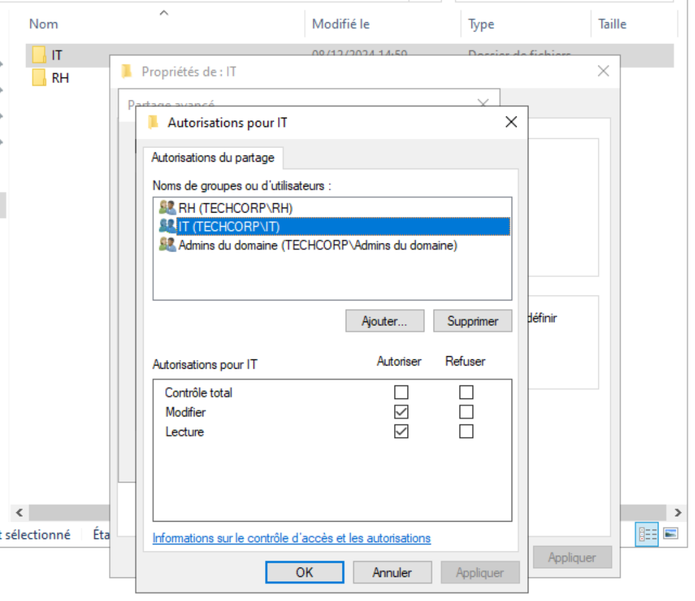
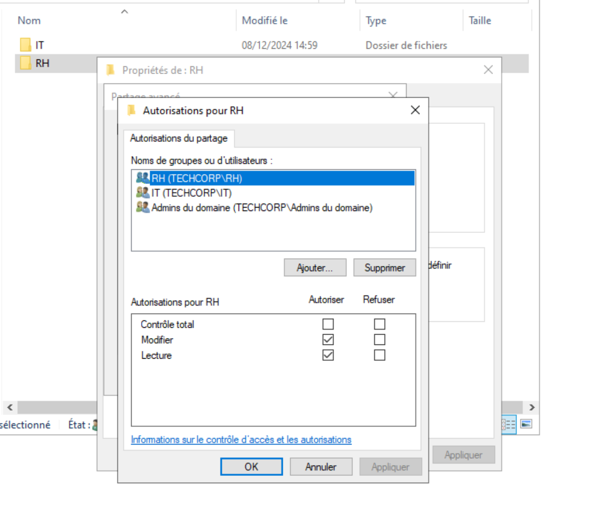

# Compte rendu du TP : Configuration d'une Infrastructure Active Directory

## Introduction
Ce TP avait pour objectif de configurer une infrastructure Active Directory (AD) pour une entreprise fictive, TechCorp, afin de centraliser la gestion des utilisateurs, des permissions, et des ressources réseau. Les services DNS et DHCP ont été intégrés pour simplifier le réseau, et des stratégies de groupe (GPO) ont été configurées pour automatiser et sécuriser les configurations.

---

## Étapes de configuration

### 1. Préparation de l’environnement
1. **Installation de Windows Server :**
   - Une machine virtuelle sous Windows Server 2019 a été installée.
   - Le système a été mis à jour, et une adresse IP statique a été attribuée.
   - 
   - 

2. **Ajout des rôles nécessaires :**
   - Les rôles Active Directory Domain Services (AD DS), DNS et DHCP ont été ajoutés via le gestionnaire de serveur.
   - 
   - 

3. **Promotion du serveur :**
   - Le serveur a été promu en contrôleur de domaine, avec création du domaine `techcorp.local`.
   - 

---

### 2. Configuration de l’Active Directory
1. **Création des Unités Organisationnelles (OU) :**
   - Les OU suivantes ont été créées :
     - RH
     - IT
     - Admins
   - 
   - 
   - 

2. **Ajout des utilisateurs :**
   - Les comptes utilisateurs ont été créés pour chaque employé, associés à leur groupe et OU respectifs.
   - 

---

### 5. Gestion des permissions d’accès
1. **Création des dossiers partagés :**
   - Dossiers `RH` et `IT` créés sur le contrôleur de domaine avec permissions spécifiques.
   - 
   - 

2. **Définition des permissions NTFS :**
   - Accès exclusif configuré pour chaque groupe (RH et IT).
   - 
   - 

3. **Tests d’accès :**
   - Vérification des accès et refus selon les comptes utilisateurs.
   - 
   - 

---

### 6. Configuration des stratégies de groupe (GPO)
1. **Création des GPO :**
   - GPO pour chaque OU avec des règles spécifiques :
     - **RH :** Désactivation du panneau de configuration, interdiction d’installer des logiciels.
     - 
     - **IT :** Déploiement d’un fond d’écran personnalisé avec le logo TechCorp.
     - 

---

### 7. Vérifications et Validation
- Résultats finaux documentés.
- 

---

## Conclusion
Le TP a permis de mettre en place une infrastructure Active Directory complète et fonctionnelle, avec centralisation de la gestion des utilisateurs, des permissions, et des configurations réseau. Les objectifs ont été atteints, et le système a été validé à travers des tests exhaustifs.

---

## Annexes
- Captures d’écran des étapes clés.
- Résultats des tests `nslookup`, DHCP, et GPO.
- Logo TechCorp utilisé pour les GPO.

---

## Livrables
Envoyez ce compte rendu, accompagné des fichiers annexes, à l’adresse suivante avant le **08/12/2024 23h59** : `anthony@avalone-fr.com`.
